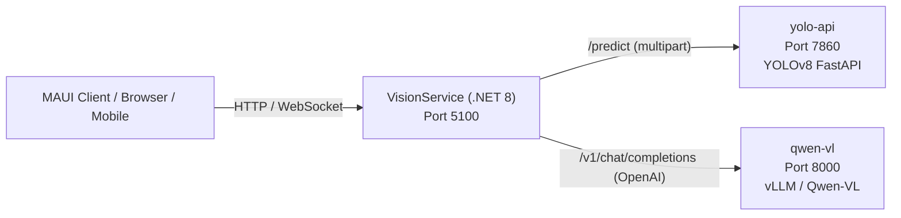

# Vision Service

A production-ready **.NET 8** microservice that orchestrates **YOLOv8** and **Qwen-VL** AI backends for camera vision tasks: object detection, instance segmentation, pose estimation, image captioning, visual question answering, OCR, and multi-model pipelines — all behind a unified REST + WebSocket API.

---

## Architecture



**Component overview:**

| Component | Technology | Port |
|-----------|-----------|------|
| VisionService | .NET 8 Minimal API | 5100 |
| yolo-api | YOLOv8 via FastAPI | 7860 |
| qwen-vl | Qwen-VL via vLLM (OpenAI-compatible) | 8000 |

---

## Quick Start

**Prerequisites:** Docker Desktop with GPU support (NVIDIA drivers + `nvidia-container-toolkit`).

```bash
# Clone the repository
git clone https://github.com/WallyWest21/vision-service.git
cd vision-service/vision-service   # Docker Compose files live here

# Start the full stack
docker compose up -d

# Verify everything is healthy
curl http://localhost:5100/health
curl http://localhost:7860/health
curl http://localhost:8000/health
```

Open the interactive API docs: **[http://localhost:5100/swagger](http://localhost:5100/swagger)**

### CPU-only (no GPU)

```bash
cd vision-service/vision-service   # if not already there
docker compose -f docker-compose.yml -f docker-compose.cpu.yml up -d
```

---

## API Overview

All endpoints require the `X-Api-Key` header when authentication is enabled (`Auth__Enabled=true`).

### YOLO Endpoints

| Method | Path | Description |
|--------|------|-------------|
| `POST` | `/api/v1/detect` | Detect objects with bounding boxes |
| `POST` | `/api/v1/detect/batch` | Batch object detection (multiple images) |
| `POST` | `/api/v1/segment` | Instance segmentation masks |
| `POST` | `/api/v1/classify` | Image classification (top-N) |
| `POST` | `/api/v1/pose` | Human pose estimation (keypoints) |

### Qwen-VL Endpoints

| Method | Path | Description |
|--------|------|-------------|
| `POST` | `/api/v1/ask` | Visual question answering |
| `POST` | `/api/v1/caption` | Generate image caption |
| `POST` | `/api/v1/ocr` | Extract text from image |
| `POST` | `/api/v1/analyze` | Custom analysis with system prompt |
| `POST` | `/api/v1/compare` | Compare two images |
| `POST` | `/api/v1/describe/detailed` | Long-form scene description |

### Pipeline Endpoints

| Method | Path | Description |
|--------|------|-------------|
| `POST` | `/api/v1/pipeline/detect-and-describe` | YOLO detect → Qwen-VL describe each object |
| `POST` | `/api/v1/pipeline/safety-check` | Combined safety analysis |
| `POST` | `/api/v1/pipeline/inventory` | Count and classify items |
| `POST` | `/api/v1/pipeline/scene` | Full scene: detections + caption + OCR |

### Admin & Utility

| Method | Path | Description |
|--------|------|-------------|
| `GET` | `/api/v1/admin/keys` | List API keys (values masked) |
| `POST` | `/api/v1/admin/keys` | Generate a new API key |
| `GET` | `/api/v1/admin/settings` | View runtime settings |
| `PUT` | `/api/v1/admin/settings` | Update runtime settings |
| `POST` | `/api/v1/playground` | Interactive test: detect + caption in one request |
| `WS` | `/ws/stream` | Real-time frame processing (WebSocket) |
| `GET` | `/health` | Overall service health |
| `GET` | `/health/ready` | Readiness (backends reachable) |
| `GET` | `/health/live` | Liveness (process alive) |
| `GET` | `/metrics` | Prometheus metrics |

---

## Configuration Reference

Configuration is loaded from `appsettings.json` and can be overridden via environment variables using `__` (double underscore) as the hierarchy separator.

### YOLO Backend (`Yolo`)

| Key | Env Var | Default | Description |
|-----|---------|---------|-------------|
| `Yolo:BaseUrl` | `Yolo__BaseUrl` | `http://yolo-api:7860` | YOLOv8 FastAPI base URL |
| `Yolo:TimeoutSeconds` | `Yolo__TimeoutSeconds` | `30` | HTTP request timeout |
| `Yolo:MaxRetries` | `Yolo__MaxRetries` | `3` | Polly retry attempts |
| `Yolo:CircuitBreakerThreshold` | `Yolo__CircuitBreakerThreshold` | `5` | Failures before circuit opens |
| `Yolo:CircuitBreakerDurationSeconds` | `Yolo__CircuitBreakerDurationSeconds` | `30` | Circuit breaker open duration |

### Qwen-VL Backend (`QwenVl`)

| Key | Env Var | Default | Description |
|-----|---------|---------|-------------|
| `QwenVl:BaseUrl` | `QwenVl__BaseUrl` | `http://qwen-vl:8000` | Qwen-VL vLLM base URL |
| `QwenVl:ModelName` | `QwenVl__ModelName` | `Qwen/Qwen2.5-VL-7B-Instruct` | Model identifier |
| `QwenVl:MaxTokens` | `QwenVl__MaxTokens` | `1024` | Max response tokens |
| `QwenVl:Temperature` | `QwenVl__Temperature` | `0.7` | Sampling temperature (0.0–2.0) |
| `QwenVl:TimeoutSeconds` | `QwenVl__TimeoutSeconds` | `120` | HTTP request timeout |
| `QwenVl:MaxRetries` | `QwenVl__MaxRetries` | `3` | Polly retry attempts |

### Storage (`Storage`)

| Key | Env Var | Default | Description |
|-----|---------|---------|-------------|
| `Storage:ImageStoragePath` | `Storage__ImageStoragePath` | `/data/images` | Image storage root |
| `Storage:RetentionDays` | `Storage__RetentionDays` | `7` | Auto-cleanup threshold in days |
| `Storage:MaxFileSizeMb` | `Storage__MaxFileSizeMb` | `20` | Maximum upload size in MB |
| `Storage:AllowedExtensions` | `Storage__AllowedExtensions` | `.jpg,.jpeg,.png,.webp,.bmp,.gif` | Permitted file extensions |

### Authentication (`Auth`)

| Key | Env Var | Default | Description |
|-----|---------|---------|-------------|
| `Auth:Enabled` | `Auth__Enabled` | `false` | Enable API key authentication |
| `Auth:ApiKeys:0:Key` | `Auth__ApiKeys__0__Key` | *(none)* | First API key value |
| `Auth:ApiKeys:0:Name` | `Auth__ApiKeys__0__Name` | *(none)* | Display name for the key |
| `Auth:ApiKeys:0:Scopes` | `Auth__ApiKeys__0__Scopes__0` | *(none)* | Scopes: `detect`, `analyze`, `admin`, `stream` |

### Rate Limiting (`RateLimit`)

| Key | Env Var | Default | Description |
|-----|---------|---------|-------------|
| `RateLimit:RequestsPerMinute` | `RateLimit__RequestsPerMinute` | `3000` | Default requests per minute per client |
| `RateLimit:BurstSize` | `RateLimit__BurstSize` | `100` | Burst allowance above the rate limit |

### Caching (`Cache`)

| Key | Env Var | Default | Description |
|-----|---------|---------|-------------|
| `Cache:Enabled` | `Cache__Enabled` | `true` | Enable in-memory response cache |
| `Cache:DefaultTtlSeconds` | `Cache__DefaultTtlSeconds` | `300` | Cache entry TTL (seconds) |
| `Cache:MaxItems` | `Cache__MaxItems` | `1000` | Maximum cache entries |

### Performance (`Performance`)

| Key | Env Var | Default | Description |
|-----|---------|---------|-------------|
| `Performance:MinAiIntervalMs` | `Performance__MinAiIntervalMs` | `500` | Minimum ms between WebSocket AI calls |
| `Performance:MaxWebSocketFrameBytes` | `Performance__MaxWebSocketFrameBytes` | `5242880` | Max WebSocket frame size (bytes) |
| `Performance:HealthCheckIntervalSeconds` | `Performance__HealthCheckIntervalSeconds` | `30` | Backend health probe interval |
| `Performance:ImageCleanupIntervalHours` | `Performance__ImageCleanupIntervalHours` | `6` | Image cleanup job interval |
| `Performance:MaxConcurrentAiRequests` | `Performance__MaxConcurrentAiRequests` | `0` | Max concurrent AI requests (0 = unlimited) |

---

## Development Setup

### Prerequisites

- [.NET 8 SDK](https://dotnet.microsoft.com/download/dotnet/8.0)
- [Docker Desktop](https://www.docker.com/products/docker-desktop/) (for integration testing)
- An NVIDIA GPU with drivers + `nvidia-container-toolkit` (for YOLO and Qwen-VL containers)

### Build

```bash
cd vision-service
dotnet build VisionService.sln --configuration Release
```

### Run Tests

```bash
cd vision-service
dotnet test VisionService.sln --configuration Release
```

### Run Locally (backends in Docker)

```bash
# Start AI backends only
cd vision-service
docker compose up -d yolo-api qwen-vl

# Run the .NET service with development settings
cd src/VisionService
dotnet run
```

The development configuration in `appsettings.Development.json` points to `localhost:7861` (YOLO) and `localhost:8001` (Qwen-VL) to match the Docker Compose exposed ports.

### Interactive API Docs

Once running, open **[http://localhost:5100/swagger](http://localhost:5100/swagger)** for the full Swagger UI with request/response examples.

---

## Project Structure

```
vision-service/          ← .NET solution root
  src/
    VisionService/
      Clients/           ← IYoloClient, IQwenVlClient typed HTTP clients
      Configuration/     ← Options classes (YoloOptions, QwenVlOptions, …)
      Endpoints/         ← Minimal API endpoint groups
      Events/            ← In-process event bus
      Jobs/              ← Background hosted services (cleanup, health check)
      Middleware/        ← Auth, CORS, rate limit, security headers, correlation ID
      Models/            ← DTOs (Detection, BoundingBox, Keypoint, …)
      Services/          ← ImageService, ResponseCacheService
      Program.cs
    VisionService.Tests/ ← xUnit integration + unit tests
  docker/
    Dockerfile           ← Multi-stage .NET 8 build
    yolo/                ← YOLOv8 FastAPI container
  docs/
    service-plan.md
    api-reference.md
    deployment-guide.md
    environment-variables.md
```

---

## Further Reading

- [API Reference](vision-service/docs/api-reference.md) — detailed endpoint documentation with curl examples
- [Deployment Guide](vision-service/docs/deployment-guide.md) — Docker Compose, Kubernetes, GPU setup, TLS, monitoring
- [Environment Variables](vision-service/docs/environment-variables.md) — full env var override reference

---

## License

This project is licensed under the [MIT License](LICENSE).
